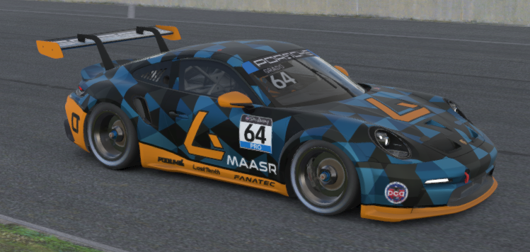

# iRacing Livery Builder



## Installation

### Developer Install

- [Install `pdm`](https://pdm-project.org/latest/#installation)
- Create development environment

	```
	pdm sync
	```
	
	This will create a python virtual environment, and install all dependencies

## Usage

- Build a livery

    ```
    pdm run ilivery <CONFIG>
    ```
    
    - Use `--show` to display the livery file
    - Use `--save` to save the livery directly into your iracing paint directory (only on Windows)
    - Use `--help` for additional instructions and options

## Building a Livery

Liveries are entirely defined via a configuration file. The livery configs are defined using [pydantic](https://docs.pydantic.dev/latest/), which is a great data validation library.

Take a look at the [config definitions](./livery/config), which document all available options. The main livery config can be found in [livery_config](./livery/config/livery_config.py).

You can build my personal s12 livery with:

```bash
pdm run ilivery configs/s12/porsche_cup_992.jsonnet
```

## Livery Templates

Livery templates are used to make livery building easier. These are standard `.psd` template files from iRacing, with additional manual segmentation.

By manually segmenting portions of the livery (body, wing, etc), you can easily paint specific sections of a livery.

The important part of each template are the `segment` layers. These layers are treated as boolean masks, the actual color doesn't matter. You can reference any layer in the `.psd` template when building the livery in your config.

Head on over to [templates](./resources/templates) to see existing templates.

## Examples

Coming soon

## Developer

### Running tests

Run all tests with 

```
pdm run pytest tests
```

## Changelog

See [CHANGELOG.md](./docs/CHANGELOG.md)
